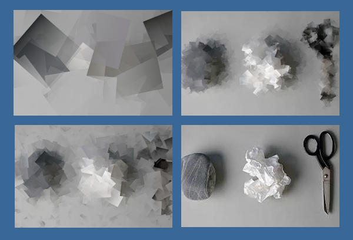

# # CS101 Fall 2025: Lab 02

## Assignment: Build Your Own Game of *Rock, Paper, Scissors*!

Welcome to your programming assignment for CS101! In this lab, you will complete a Rock Paper Scissors game by filling in the missing parts of the provided `main.py` file.

## Assigned and Due

* __Assigned__: Wednesday, 11 Sept 2025 at 2:35pm
* __Due__: Wednesday 18 Sept 2025 at 2:35pm
* __Expiration__: Wednesday, 25 Sept 2025 at 2:35pm
Note: the *expiration* date is the last date you can submit your work for a grade.

---



You are invited to complete a game of Rock, Paper, Scissors using UV, an editor and terminal commands. The rules of the game may be found at [https://en.wikipedia.org/wiki/Rock_paper_scissors](https://en.wikipedia.org/wiki/Rock_paper_scissors).

## Project Goals

* To practice breaking a program into functions to improve its structure and maintainability.
* To practice writing documentation and comments to help users understand how the code works.
* To gain experience in using UV to manage a Python project.

## Project Overview

While browsing GitHub, you come across an open source project of the famous, `Rock, Paper, Scissors`, game. You are immediately interested in playing this old favorite game, and so you clone the project. As you look at the code, you notice that has been written in a hurry because the code is so messy. Source code like this is often called `spaghetti code`.

For instance, the scripting does not seem to have much structure to help maintain its internal methods, there are few functions to break-up the work into manageable parts, and there is little documentation to assist users in understanding how the program works. In addition, there are some parts of the code are just *seemingly* impossible to understand!

This lab assignment invites you to rewrite this spaghetti code to prepare a carefully crafted piece of structured software. To rewrite it, you are to add functions and documentation to help its users to comprehend, use and maintain the code.

### Refactor and Rewrite the Source Code

Refactoring code means to break the code into smaller pieces (e.g., functions) and to add comments and documentation to help the user to understand how the code works. This is a very important skill for any programmer as it helps to make the code more maintainable and easier to understand. You are now ready to rewrite the source code using the original code that is provided to you in your working repository.

__Note__: you can run the `main_spaghetti_code.py` file to see how the game should work, but do not simply copy and paste its code directly into your restructured project! Instead, use the given code as a guide to help you implement the required functionality in `main.py` such as adding comments, docstrings, and functions to make the code more *readable* for comprehension and maintenance.

## Project Access

Once you gave accepted this assignment by clicking the **GitHub Classroom** link provided to you in **Materials** lab of the main website for the course [https://cmpsc101fall2025datastructures.github.io/site/](https://cmpsc101fall2025datastructures.github.io/site/), you are to clone the repository to your computer where you are to work. The clone command is the following; `git clone <your-github-repository`.

### Two Source Code Files

There are two course codes to use in this lab; `main.py` and `main_spaghetti_code.py`. The `main.py` file is the one that you will be working on to complete the assignment. The `main_spaghetti_code.py` file is provided as a reference if you get stuck or want to check your work.

## Setup Instructions

1. __Setup your Python environment using UV__

   * Clone your working repository to your computer if you have not already done so.
   * Start up your Python environment using UV as described in the [Rock Paper Scissors Game: Setup and Usage](#rock-paper-scissors-game-setup-and-usage) section below.
   * UV documentation available at [https://docs.astral.sh/uv/guides/projects/#creating-a-new-project](https://docs.astral.sh/uv/guides/projects/#creating-a-new-project).

2. __Open `main.py` On Your Own Machine__

   * You will see several functions with `TO-DO` comments. Your job is to complete these functions so the game works as described (e.g., will run to play a game of *Rock Paper Scissors*).
   * Please remove the `TO-DO` comments as you finish each part.

3. __Refactor the Code by Implementing Functions with Documentation__

   * Each function to complete has already been added to the code in `main.py` and should have a docstring and comments as needed. The  `TO-DO` tags guide the user to implement the following functionalities.

     * Please be sure that your program implements the following features:
       * The user can enter their choice (`rock`, `paper`, or `scissors`, or `1`, `2` or `3`, respectively).
       * The computer randomly selects its moves.
       * The winner of each round is determined and displayed with colorful output.
       * Scores are tracked and the overall winner is announced at the end.

4. __Test Your Program__

   * Run your spaghetti code using:

    ```sh
    uv main_spaghetti_code.py
    ```

   * Run your refactored code using:

    ```sh
    uv run main.py
    ```

   * Make sure it works for all valid and invalid inputs, and that the output is colorful and friendly!

The proper output should look something like the following.

``` bash
$ uv run main_spaghetti_code.py

Welcome to Rock, Paper, Scissors!
You can type 'rock', 'paper', 'scissors' or use 1 for rock, 2 for paper, 3 for scissors.

Round 1 of 3
Choose rock (1), paper (2), or scissors (3): 1
Computer chose: scissors
You win this round!

Round 2 of 3
Choose rock (1), paper (2), or scissors (3): 3
Computer chose: rock
Computer wins this round!

Round 3 of 3
Choose rock (1), paper (2), or scissors (3): 2
Computer chose: paper
It's a tie!

Game Over!
Your score: 1
Computer score: 1
It's a tie game!
```

5. __Submit Your Work__

   * Save your changes to `main.py` and ensure everything is working correctly.
   * Make your commits as you work. You are expected to have multiple commits showing your progress which will be checked by GatorGrade. These multiple commits are to help you build good programming habits.

## Virtual Environment Setup and Usage

This section describes how to set up and run the Rock Paper Scissors game for this lab. The game demonstrates basic Python concepts and uses a virtual environment managed by [uv](https://github.com/astral-sh/uv). It features enhanced command-line interaction and colorful output using the `typer` and `rich` libraries.

### Setup Instructions

1. Install uv (if not already installed):

  ```sh
  pip install uv
  ```

1. Create a virtual environment:

  ```sh
  uv venv
  ```

1. Activate the virtual environment:

  ```sh
  source .venv/bin/activate
  ```

Note: On Windows, use the following instead

  ```sh
  .venv\Scripts\activate
  ```

1. Install dependencies:

  ```sh
  uv pip install typer rich
  ```

### How to Run the Game

From the project root directory, run:

```sh
uv run main.py
```

## Ideas for Extension

If you are looking for an extra challenge, consider implementing one or more of the following features:

* Add a score history or leaderboard.
* Allow the user to play unlimited rounds until they choose to quit.
* Add ASCII art for each move.
* Let the user play against another human.
* Add sound effects (using a cross-platform library).
* Track and display statistics (win/loss/tie percentages).
* Implement a "best of N" mode.

## Deliverable

Once you have completed your work on the code, you are to submit the code along with your completed writing assessment at `writing/reflection.md`.

Writing assignment: [Reflections](writing/reflection.md)

Note: As you work, please periodically commit your changes and push them to your GitHub repository. This will ensure that your work is saved and can be reviewed by your instructor.

## Submission

As you are working on your lab, you are to commit and push regularly. The commands are the following.

 ``` bash
git add -A
git commit -m ``Your notes about commit here''
git push
```

After you have pushed your work to your repository, please visit the repository at the GitHub website (you may have to log-in using your browser) to verify that your files were correctly sent.

## Project Assessment

The grade that a student receives on this assignment will have the following components.

* **GitHub Actions CI Build Status [up to 25%]:**: For the lab repository associated with this assignment students will receive a checkmark grade if their last before-the-deadline build passes. This is only checking some baseline writing and commit requirements as well as correct running of the program. An additional reduction will given if the commit log shows a cluster of commits at the end clearly used just to pass this requirement. An addition reduction will also be given if there is no commit during lab work times. All other requirements are evaluated manually.

* **Mastery of Technical Writing [up to 50%]:**: Students will also receive a checkmark grade when the responses to the writing questions presented in the `reflection.md` reveal a proficiency of both writing skills and technical knowledge. To receive a checkmark grade, the submitted writing should have correct spelling, grammar, and punctuation in addition to following the rules of Markdown and providing conceptually and technically accurate answers.

* **Mastery of Technical Knowledge and Skills [up to 25%]**: Students will receive a portion of their assignment grade when their program implementation reveals that they have mastered all of the technical knowledge and skills developed during the completion of this assignment. As a part of this grade, the instructor will assess aspects of the programming including, but not limited to, the completeness and the correctness of the program and the use of effective source code comments.

---

## GatorGrade

### Checks for GatorGrade

For immediate feedback on submissions, we will be using Gator Grade to inform the of missing components in the submission. As you submit, you will notice that there is a thick red X that will change to a green check mark when all components have been included in the submission. You are encouraged to click on the red X to find a listing of the components to address.

You can check the baseline writing and commit requirements for this lab assignment by running department's assignment checking `gatorgrade` tool. To use `gatorgrade`, you first need to make sure you have Python3 installed (type `python --version` to check). If you do not have Python installed, please see:

- [Setting Up Python on Windows](https://realpython.com/lessons/python-windows-setup/)
- [Python 3 Installation and Setup Guide](https://realpython.com/installing-python/)
- [How to Install Python 3 and Set Up a Local Programming Environment on Windows 10](https://www.digitalocean.com/community/tutorials/how-to-install-python-3-and-set-up-a-local-programming-environment-on-windows-10)

Then, if you have not done so already, you need to install `gatorgrade`:

- First, [install `pipx`](https://pypa.github.io/pipx/installation/)
- Then, install `gatorgrade` with `pipx install gatorgrade`

Finally, you can run `gatorgrade`: `gatorgrade --config config/gatorgrade.yml`

## Seeking Assistance

* Extra resources for using markdown include;
  + [Markdown Tidbits](https://www.youtube.com/watch?v=cdJEUAy5IyA)
  + [Markdown Cheatsheet](https://github.com/adam-p/markdown-here/wiki/Markdown-Cheatsheet)
* Do not forget to use the above git commands to push your work to the cloud for the instructor to grade your assignment. You can go to your GitHub repository using your browser to verify that your files have been submitted. Please see the TL’s or the instructor if you have any questions about assignment submission.

Students who have questions about this project outside of the lab time are invited to ask them in the course's Discord channel or during instructor's or TL's office hours.

---
For questions or suggestions about the game, please contact the course instructor.
